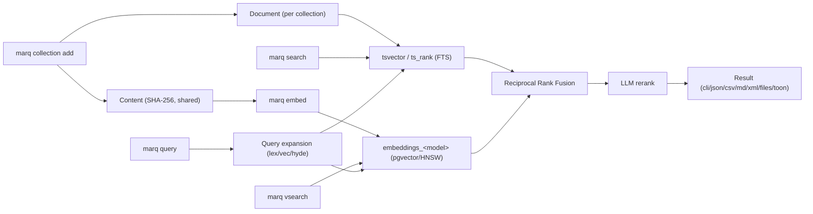

# Architecture

## Storage

Postgres + pgvector, one schema (`MARQ_POSTGRES_SCHEMA`, default
`qmd_py` — the Python package name, unrelated to the `marq` product
name; see [Configuration](configuration.md#marq_postgres_schema)),
managed by Alembic migrations.

**Content is content-addressed.** A document's body is stored once, in
one `Content` table keyed by SHA-256 hash, shared across every
collection — not one copy per collection. A `Document` row (per
collection, per path) just points at a hash. Two consequences:

- Indexing a file whose content already exists anywhere in the database
  — a second git worktree, a branch that's mostly unchanged, the same
  file indexed into two different collections — costs nothing beyond
  recognizing the hash already exists. There's deliberately no separate
  "clone this collection cheaply" feature: the storage design already
  makes that free, so `collection add` on the new worktree/branch *is*
  the cheap-clone operation.
- Removing the last `Document` reference to a hash is what makes that
  content eligible for cleanup (`marq cleanup`) — the content itself
  doesn't belong to any one collection.

**Each embedding model gets its own physical table**
(`embeddings_<model-slug>`), created on first use. This fixes a real
limitation in the original qmd (one shared embeddings column,
destructively dropped and rebuilt on model switch): here, switching
`MARQ_EMBED_MODEL` is additive — a new table — never destructive, and
multiple models can coexist side by side. Vector search runs against an
HNSW index on the model's own table.

## Search

Three retrieval mechanisms, one fusion step, one optional reranking
pass:

- **BM25** (`tsvector`/`ts_rank`) — Postgres full-text search. A
  generated, always-current `tsvector` column indexes title/path/body
  with different weights.
- **Vector similarity** (pgvector, HNSW index) — cosine distance over
  chunked document embeddings, one chunk-table row per (document, chunk
  position).
- **Reciprocal Rank Fusion** — combines multiple ranked lists (BM25,
  vector, and one list per expanded sub-query) into one score per
  document by rank, not raw score, so lists with very different score
  distributions still combine sensibly. The original (un-expanded)
  query's own lists get double weight relative to expansion-derived
  ones.
- **LLM reranking** — the fused top candidates get a final relevance
  pass from a dedicated reranker model, blended with the RRF score
  (weighted more toward RRF for already-high-ranked candidates, more
  toward the reranker for lower-ranked ones that need a chance at
  recovery). Skippable with `--no-rerank` for speed on CPU-only setups.

See [Search & query](commands/search-and-query.md) for the query-facing
side of all this (`search`/`vsearch`/`query`, structured queries,
`--explain`).

## LLM client

A pure `httpx` HTTP client (`src/qmd_py/llm/client.py`) against an
OpenAI-style endpoint (`MARQ_LLM_BASE_URL`) — embeddings, chat
completions (query expansion), and reranking are all plain HTTP calls.
No local model loading, no GPU/device concept, anywhere in the Python
process itself — a deliberate simplification versus the original qmd's
local `node-llama-cpp` model loading.

## ACL

The schema and every read/write call site are structured for real
multi-user access control — a `Collection.owner_user_id` foreign key, a
`CollectionGrant` table for future sharing, and a `can_access()`
function (`src/qmd_py/auth.py`) called as a real choke point at every
collection-scoped operation (search, get, multi-get, collection
management) — but `can_access()` itself is currently mocked to always
return `True`. The actual use case today is a single local user
(`MARQ_DEFAULT_USER_EMAIL`, created on first use as a real row, not just
an abstract concept).

This is a deliberate, not accidental, gap: the intent is that swapping
in a real check later is additive — one function body
(`user.is_admin or user.id == collection.owner_user_id or exists(...
CollectionGrant)`) — not a rearchitecture. The test suite proves the
plumbing already works: `tests/test_acl_gating.py` installs a fake
per-owner `can_access()` and a genuinely different second user, and
confirms every choke point correctly denies that user (returning empty/
not-found results for search-style operations, `PermissionDeniedError`
for collection-management operations) while the real owner is
unaffected — without changing a single call site.

## CLI

Built on `click`. `src/qmd_py/cli/main.py` assembles one top-level group
from commands defined across `src/qmd_py/cli/commands/*.py` (one file
per command or command group). `main()` wraps the whole CLI in a
`try/except` around pydantic's `ValidationError`, so a missing/invalid
`MARQ_*` setting prints a short message instead of a raw traceback — see
[Configuration](configuration.md).

## MCP server

The official `mcp` Python SDK's `FastMCP`
(`src/qmd_py/mcp/server.py`) — see [MCP server](mcp-server.md) for the
full picture (transports, tools, the `marq://` resource, REST
endpoints).

## Naming

The CLI binary, MCP server identity, `marq://` URI scheme, and
`MARQ_*` environment variable prefix are all branded `marq` — a
deliberate rename away from the original qmd's naming, specifically to
avoid confusion with that project. The **Python package itself stays
named `qmd_py`** (distribution `qmd-py`): that's an internal
implementation detail no CLI/MCP user ever sees (no one runs `import
marq`), and renaming it is a separate, larger, currently out-of-scope
change with no user-facing benefit.
