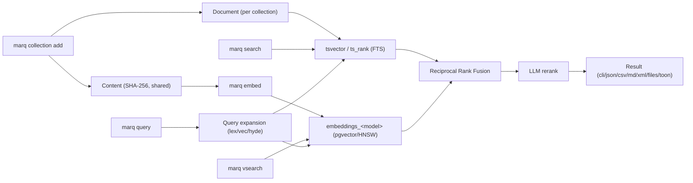

# marq

**marq** is a centralized markdown/code search engine: hybrid BM25 +
vector similarity + LLM reranking over Postgres/pgvector, exposed
through a CLI and an MCP server for AI agents.

Point it at any folder — notes, docs, a wiki export, a source tree — and
it becomes a searchable collection. Search combines exact keyword
matching (BM25), semantic similarity (vector embeddings), and an LLM
reranking pass over the fused results, so you can search by exact term,
by meaning, or both at once.

## Why "marq"?

marq is inspired by [qmd](https://github.com/tobi/qmd) but is not a fork
or a drop-in replacement — it's a from-scratch Python rewrite built
around different tradeoffs: a shared Postgres/pgvector backend instead
of a per-project SQLite index, a pure HTTP LLM client instead of local
model loading, and a schema designed for eventual multi-user access
control instead of a single local user. It has its own name (CLI binary,
MCP server identity, `marq://` URI scheme, `MARQ_*` environment
variables) specifically so it isn't confused with the original project.

The Python package itself is still named `qmd_py` (distribution
`qmd-py`) — that's an internal implementation detail no CLI/MCP user
ever sees, and renaming it is a separate, larger, not-currently-planned
change. See [Architecture](architecture.md) for the reasoning.

## How it fits together

`marq search` (BM25 only) and `marq vsearch` (vector only) are the fast,
single-signal paths. `marq query` — the recommended default — expands
your query into typed sub-queries, runs all of them, fuses the ranked
lists with Reciprocal Rank Fusion, and reranks the fused candidates with
an LLM before returning results.

## Where to go next

- **[Quickstart](quickstart.md)** — install, configure, index your first
  collection, run your first search.
- **[Configuration](configuration.md)** — every `MARQ_*` environment
  variable and what it controls.
- **[Commands](commands/index.md)** — the full CLI surface, grouped by
  what each command does.
- **[MCP server](mcp-server.md)** — running marq as an MCP server for
  agents/editors, over stdio or HTTP.
- **[Architecture](architecture.md)** — how storage, search, and access
  control are actually built.
- **[Development](development/testing.md)** — contributing: setup,
  testing conventions, code style.
